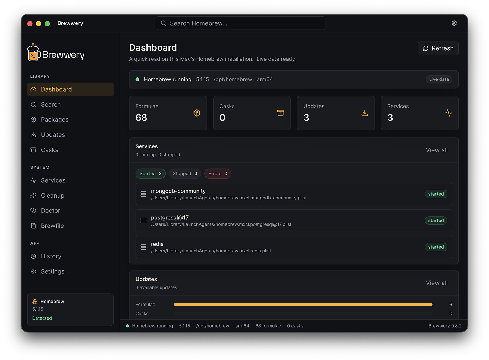
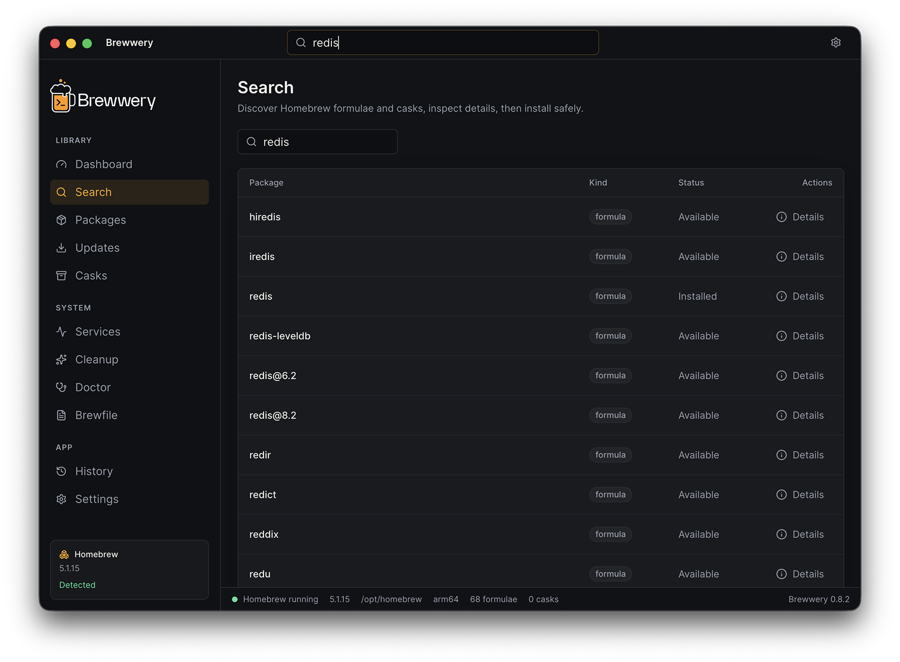
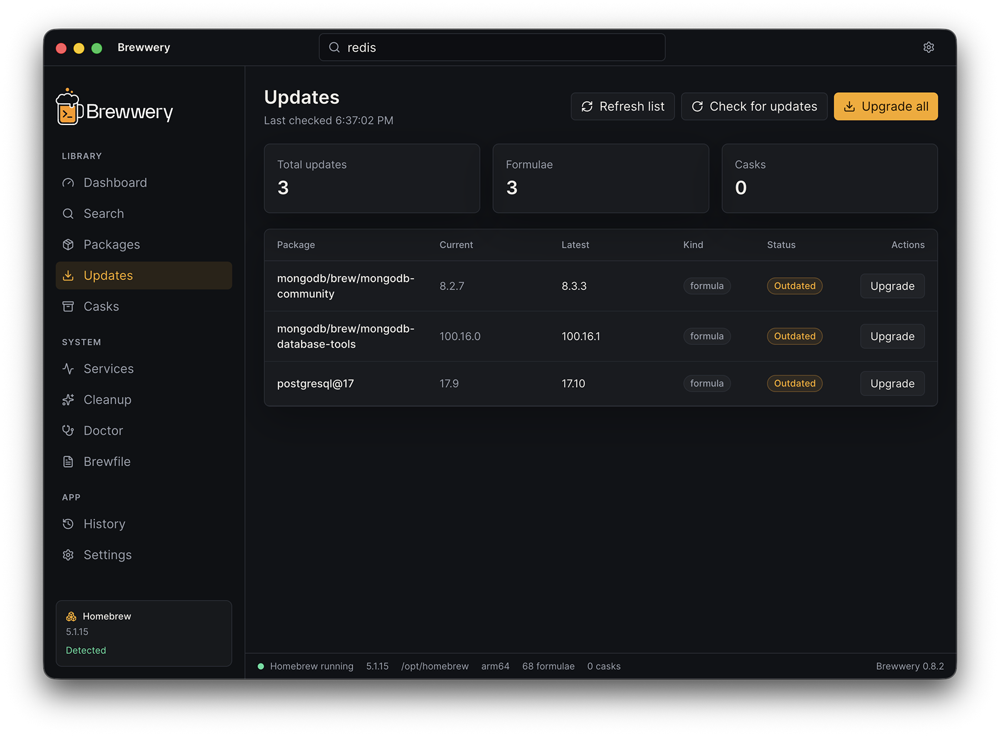

# Brewwery

Brewwery is a clean macOS desktop app to manage Homebrew packages, casks, services, updates, cleanup, diagnostics, and Brewfiles in one place.

Current status: v0.9.6 Release Candidate / feature freeze.

The project is open source, MIT licensed, and targets macOS first, with Apple Silicon as the primary platform.

See [CHANGELOG.md](CHANGELOG.md) for completed release notes.



## Features

- Detect local Homebrew installs in `/opt/homebrew` and `/usr/local`.
- Query Homebrew path, version, prefix, architecture, and config.
- List installed formulae and casks with read-only commands normalized into Brewwery models.
- Discover curated Homebrew formulae and casks from a local bundled registry.
- Save favorite formulae and casks locally.
- Search, sort, refresh, and inspect installed formulae and casks.
- Copy package names and brew install commands from a read-only detail drawer.
- Show outdated formulae and casks from Homebrew.
- Upgrade one package or all outdated packages after explicit confirmation.
- Show Homebrew services and run start, stop, or restart after explicit confirmation.
- Preview Homebrew cleanup output and run cleanup only after confirmation.
- Run brew doctor and review parsed diagnostics.
- Export and inspect Brewfile contents.
- Review local operation history with timestamps and output details.
- Search operation history, export it as JSON, and see compact result toasts after operations.
- Search Homebrew formulae and casks through a dedicated discovery page.
- Show correct installed/available state in discovery search results.
- Guard discovery search so non-Homebrew package-name input does not run `brew search`.
- Inspect discovered package metadata, including homepage, latest version, dependencies, caveats, and install command.
- Install and uninstall formulae/casks after explicit confirmation, with operation history and result toasts.
- Stream progress output for install, uninstall, upgrade, service, and cleanup operations.
- Cancel an active install, uninstall, upgrade, service, or cleanup operation after explicit confirmation.
- Stop streaming operations with fixed safety timeouts and prevent conflicting concurrent operations.
- Package unsigned macOS release-candidate builds as DMG and ZIP artifacts.
- Use a first-launch onboarding screen, tray menu, keyboard shortcuts, and a basic Settings/About page.
- Switch between System, Dark, and warm Light themes.
- Validate and save a custom Homebrew executable path for both normal and streaming Homebrew operations.
- Copy a compact diagnostics report from Settings.
- Show Dashboard last-refresh state and running-first service preview.
- Filter History to failed operations during QA.
- Keep History and live progress output responsive with capped output previews.
- Bound captured operation output in Electron main and renderer memory for long Homebrew operations.
- Show calmer, user-facing error messages with expandable technical details.
- Retry failed read and diagnostics operations from consistent error states.
- Run Rust parser and validation regression tests in CI without requiring a Node host.
- Use packaged-app release-candidate verification docs and local `.app` packaging command for DMG-independent testing.
- Prepare release-candidate release notes, known issues, install/uninstall instructions, and QA checklist.
- Provide a dark macOS utility UI with sidebar navigation and status bar.
- Define typed IPC contracts in a shared workspace package.
- Scaffold a Rust `napi-rs` core for future command parsing and execution.

## Supported Commands

- `brew --version`
- `brew config`
- `brew list --formula --json=v2`
- `brew list --cask --json=v2`
- `brew outdated --json=v2`
- `brew update`
- `brew upgrade <formula>`
- `brew upgrade --cask <cask>`
- `brew upgrade`
- `brew services list --json`
- `brew services start <service>`
- `brew services stop <service>`
- `brew services restart <service>`
- `brew cleanup -n`
- `brew cleanup`
- `brew doctor`
- `brew bundle dump --force --file=<path>`
- `brew search --formula <query>`
- `brew search --cask <query>`
- `brew info --json=v2 <formula>`
- `brew info --cask --json=v2 <cask>`
- `brew install <formula>`
- `brew install --cask <cask>`
- `brew uninstall <formula>`
- `brew uninstall --cask <cask>`

Homebrew 5 may reject `--json=v2` for `brew list`; Brewwery then falls back to `brew list --formula --versions --json` or `brew list --cask --versions --json`.

## Stack

- Electron
- React
- TypeScript
- Vite and electron-vite
- Tailwind CSS
- shadcn/ui-style local components
- Zustand
- Rust core compiled with napi-rs
- pnpm workspaces

## Project Structure

```text
.
├── desktop/                 # Electron desktop app
├── crates/brewwery-core/    # Rust napi-rs core scaffold
├── packages/shared-types/   # Shared TypeScript contracts
├── docs/                    # Architecture, security, roadmap, development
├── scripts/                 # Local helper scripts
└── package.json             # pnpm workspace root
```

## Getting Started

Install Node.js 24 and pnpm 10, then run:

```bash
pnpm install
pnpm dev
```

Build the desktop app:

```bash
pnpm build
```

Package an unsigned Apple Silicon macOS build:

```bash
pnpm package:mac
```

The generated DMG and ZIP are written to `desktop/dist-packages/`.

Build a packaged `.app` without creating a DMG:

```bash
pnpm package:mac:dir
```

Build and verify a ZIP artifact without creating a DMG:

```bash
pnpm package:mac:zip
```

Clean local packaging artifacts:

```bash
pnpm package:clean
```

Run the Release Candidate verification pass:

```bash
pnpm release:verify
```

Clean an old local beta install before fresh testing:

```bash
pnpm beta:clean-install
```

Optional packaging commands:

```bash
pnpm package:mac:x64
pnpm package:mac:universal
```

Build the Rust native core:

```bash
pnpm --filter @brewwery/brewwery-core build
```

## Distribution

Brewwery uses `electron-builder` with:

- app name: `Brewwery`
- bundle identifier: `com.brewwery.app`
- macOS category: `public.app-category.utilities`
- primary target: Apple Silicon `arm64`
- artifacts: unsigned `.dmg` and `.zip`

Current Release Candidate builds are unsigned and not notarized. macOS Gatekeeper may warn when opening downloaded builds until signing and notarization are configured.

If local DMG creation fails because of `hdiutil create ... -fs APFS`, use `pnpm package:mac:zip` or `pnpm package:mac:dir` for local verification and let GitHub Actions build the DMG on a clean macOS runner.

## Uninstall Local Build

Remove the local packaged app and Brewwery user data:

```bash
rm -rf "desktop/dist-packages/mac-arm64/Brewwery.app"
rm -rf "$HOME/Library/Application Support/Brewwery"
rm -f "$HOME/Library/Preferences/com.brewwery.app.plist"
rm -rf "$HOME/Library/Saved Application State/com.brewwery.app.savedState"
```

## Security Model

Brewwery uses typed, allowlisted Homebrew commands and disables Homebrew auto-update and analytics in app-launched command environments. Favorites and Discover are local UI features and do not add shell commands, accounts, telemetry, or cloud sync. Mutating operations in v0.9.6 are limited to package install/uninstall, package upgrades, Homebrew metadata refresh, Homebrew service start/stop/restart, and cleanup after preview. Every mutating operation requires explicit confirmation. The renderer runs with context isolation, sandboxing, no Node integration, and a narrow preload API.

No authentication, telemetry, cloud sync, monetization, donation, or support logic is included.

## Learn Homebrew

New to Homebrew, or want a refresher? These guides explain what runs underneath Brewwery:

- [What is Homebrew?](https://docs.brewwery.com/what-is-homebrew) — a plain-English introduction to the macOS package manager.
- [Common brew commands](https://docs.brewwery.com/brew-commands) — install, update, search, services, cleanup, and Brewfile.
- [Security model](https://docs.brewwery.com/security) — how Brewwery runs commands safely and locally.
- [Troubleshooting](https://docs.brewwery.com/troubleshooting) — fixes for common Homebrew and Brewwery issues.

The same reference is available in the app under **Commands**, and online at [brewwery.com](https://www.brewwery.com).

## Screenshots






## Known Limitations

- Builds are unsigned and not notarized during the Release Candidate.
- Local DMG creation may fail on some machines because of the APFS `hdiutil` issue; use `.app`/ZIP locally and GitHub Actions for release DMG artifacts.
- Apple Silicon is the recommended v1.0 target; Intel and universal builds move to v1.1 validation if needed.
- Package path and package-detail Terminal shortcuts are hidden until they can be implemented safely.
- Accessibility polish is in progress for keyboard navigation, focus visibility, VoiceOver labels, and contrast.
- Discovery search accepts only ASCII Homebrew package-name characters.
- Updates are based on local Homebrew metadata. Use `Check for updates` on the Updates page or `Check Homebrew` in Settings to run `brew update`, then refresh outdated package counts.
- No sudo or arbitrary shell command is implemented.
- No telemetry, crash reporting, cloud sync, paid/pro, donation, or support logic is included.
- See [docs/known-issues.md](docs/known-issues.md) for the full release-candidate decision list.

## License

MIT
